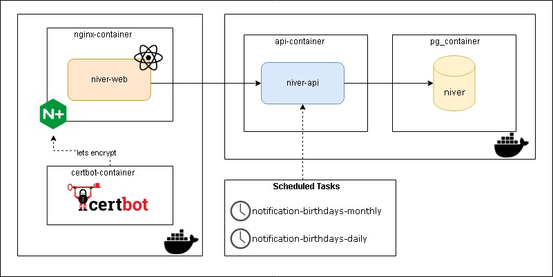

# Niver API


[](https://sonarcloud.io/summary/new_code?id=davidrezende_niver-api)
### _NiverDeQuem Platform. Manage and notify the birthdays of people who are part of a group._
Api developed in kotlin with Spring Framework. Used Postgres relational database

## Demo ( Production )

**NiverDeQuem** is available at **[here](https://niverdequem.tk).**

## Architecture


## Workflow Pipeline

The project uses [github actions](https://github.com/davidrezende/niver-api/actions) to run a build and CI/CD pipeline and [SonarCloud](https://sonarcloud.io/) integration.

>[.github/workflows/build.yml](.github/workflows/build.yml)
## Tech

- Spring Scheduled Tasks with cron
- Spring Mail ( SMTP )
- Spring Data JPA
- Spring Security with JWT
- Flyway Migration
- OpenApi3
- Docker & Docker Compose
- Postgres Database

## Features

- Register, change, view and delete a person
- Register, change, view and delete a group
- Add or remove person from group
- Create or recreate an invite for a group. The invitation is sent by URL link with a UUID identifier.
- Shows the list of birthdays by month. (Used by frontend in calendar component)
- Notifies group members of birthdays of the month and birthdays of the day by email.

## Run

NiverApi requires [Docker and Docker Compose](https://www.docker.com/)

Run docker-compose.yml

```sh
mvn clean package
docker-compose up
```
